> 

**Proyecto 1 - Manual técnico**

**Grupo 13**

**Seminario de sistemas 1**

****Objetivos****

•	Guía de Implementación: Proporcionar una guía concisa y paso a paso para implementar la aplicación web en AWS, incluyendo la configuración de dos servidores y la puesta en marcha del balanceador de carga.

•	Administración Eficiente: Facilitar la administración eficiente de la infraestructura, incluyendo instrucciones para el monitoreo de recursos, la escalabilidad y la gestión de problemas comunes.

•	Seguridad y Mejores Prácticas: Destacar las prácticas recomendadas en materia de seguridad y resiliencia, ayudando a los usuarios a garantizar la confiabilidad y la protección de la aplicación y los datos.

> ****Arquitectura de la aplicación****

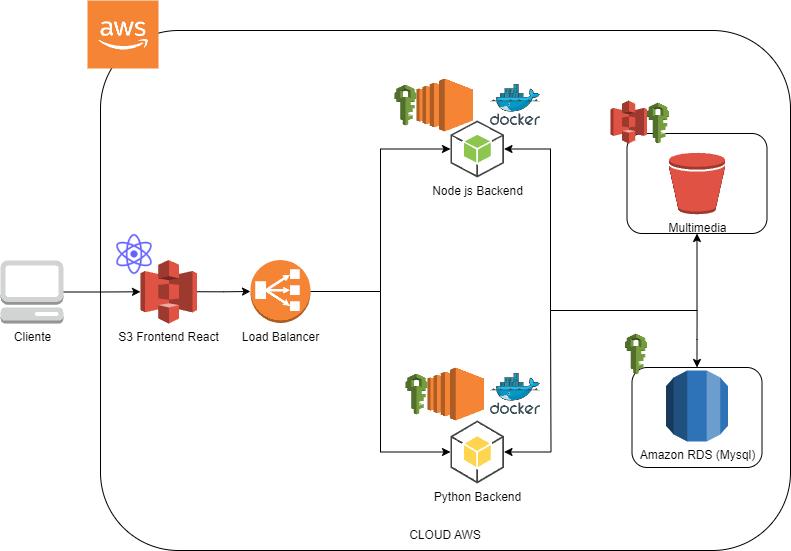

> Para esta aplicación se utilizó el cloud de AWS. En un bucket en s3
> configurado para almacenar sitios web estáticos, luego se configuro un
> load balancer para realizar la distribución entre los 2 backends
> solicitados, uno en node js utilizando JavaScript y el otro en Python,
> cada uno ejecutándose en una EC2 por medio de un contenedor de Docker.
> Por otra parte, la base de datos se manejo con el servicio RDS de
> Amazon utilizando una instancia de MySQL. Por otro lado, el bucket
> para almacenar toda la multimedia de la aplicación se configuro con el
> servicio de s3.
>
> ****Modelo Entidad Relación****

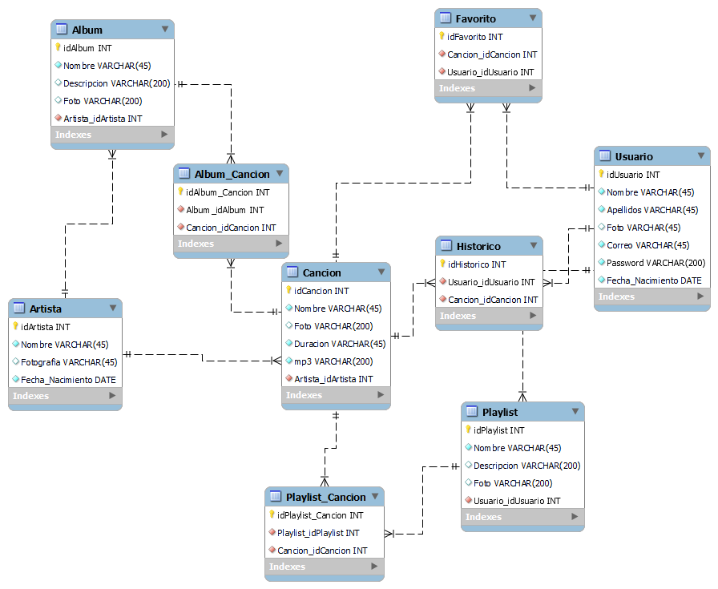

> ****Usuarios IAM****
>**EC2**:
> Usuario encargado de todos los temas referentes a EC2.

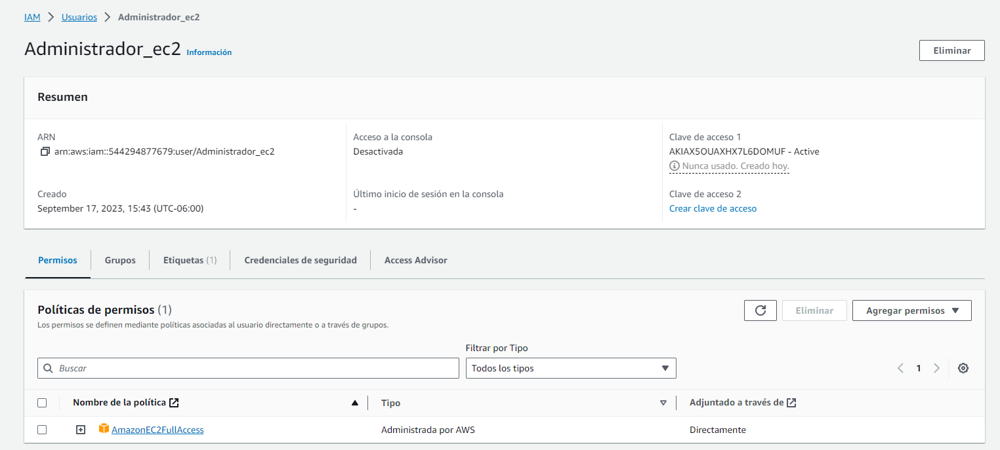

> **S3**:\
> Usuario encargado del servicio S3.

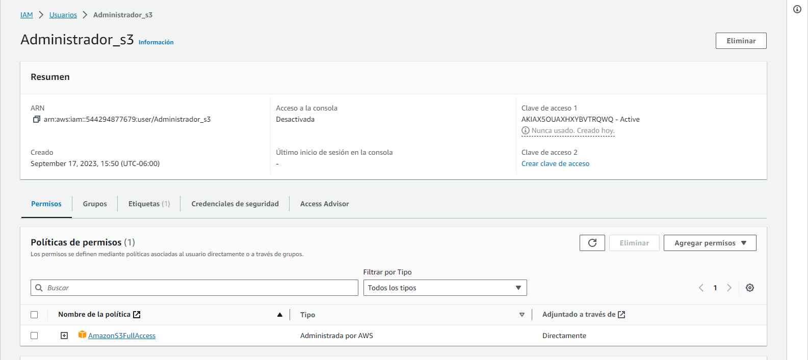

> **Base de datos**:\
> Usuario encargado del servicio Amazon RDS.

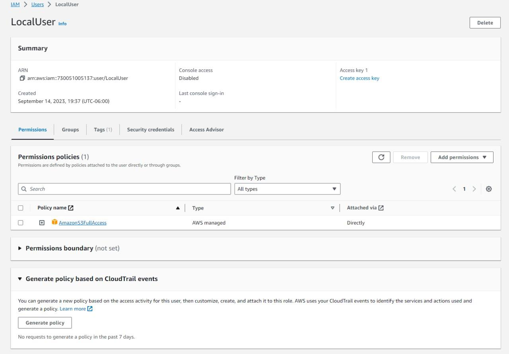

> ****Configuración de Servicios****

>Balanceador de carga:
> Se creo un balanceador de carga para poder utilizar los 2 servidores
> solicitados, esto mediante un "Target group" en el cual se identificaron los servidores
> a los que el balanceador debía hacer referencia y en el puerto que la aplicación necesitaba.

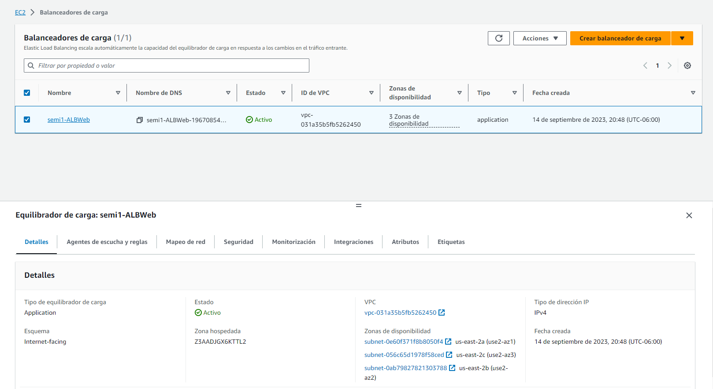

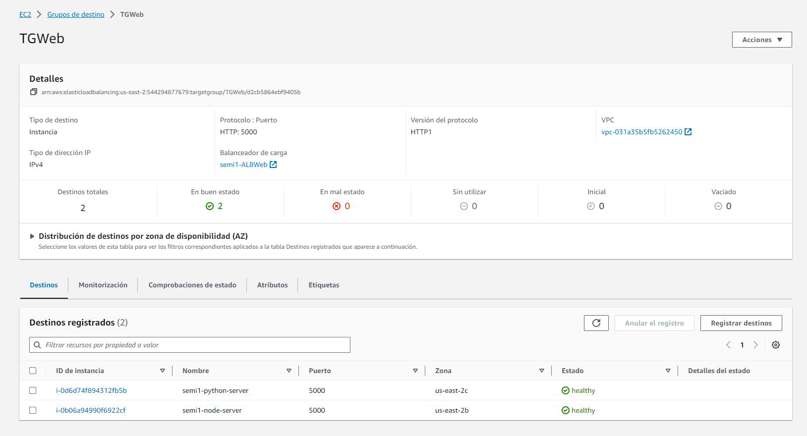

> **Servidores para backend**:\
> Se lanzaron 2 instancias en el servicio EC2 para el manejo de estos 2
> servidores, en cada instancia se ejecuto un container de Docker en el
> cual mediante el puerto 5000 escucha las solicitudes del cliente por
> medio del balanceador de carga.

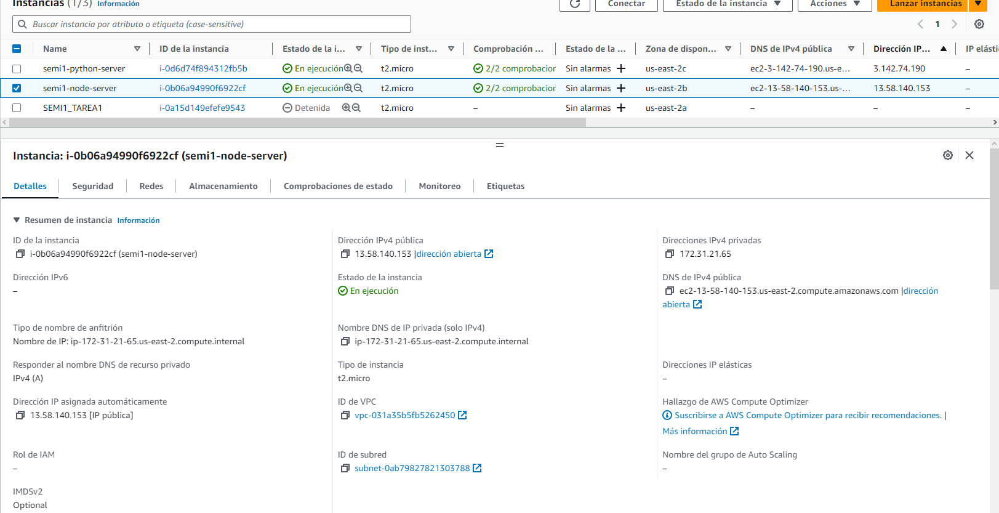
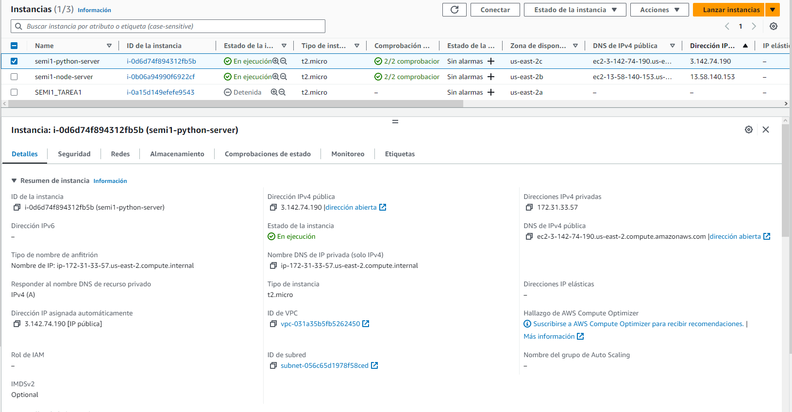

> **Buckets**:\
> Se crearon 2 buckets en el servicio S3 para el desarrollo de este
> proyecto, uno para la multimedia de la aplicación y otro para
> almacenar el sitio web, este ultimo se configuro para almacenar sitios
> web estáticos.

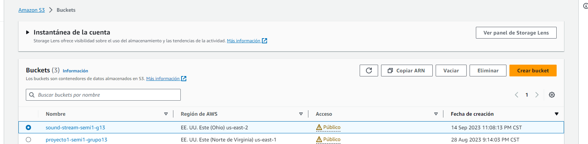

> **Base de datos**:\
> Se creo una instancia de base de datos de MySQL utilizando Amazon RDS.

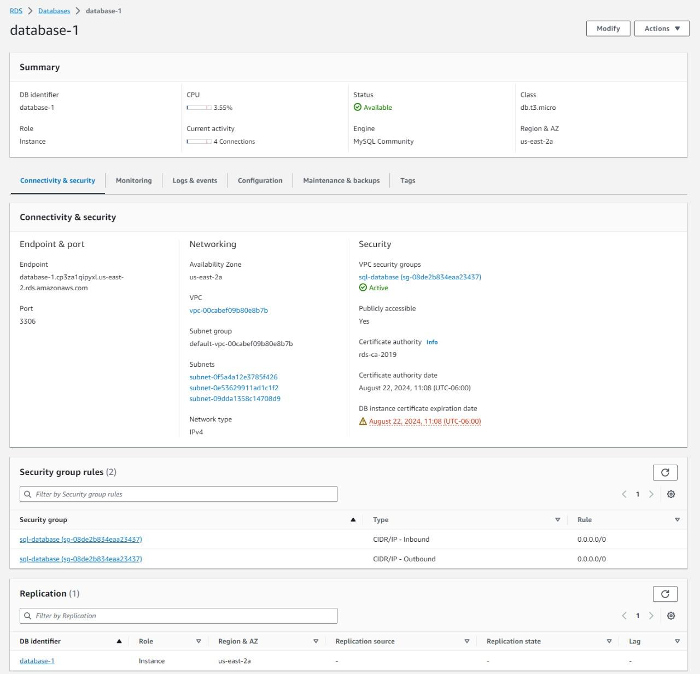

****Conclusiones****
•	Implementación Exitosa: Con la información proporcionada en este manual técnico, los usuarios deberían ser capaces de implementar con éxito una aplicación web similar a Spotify en AWS, aprovechando la configuración de dos servidores y el balanceador de carga para garantizar la disponibilidad y el rendimiento.

•	Administración Eficiente y Segura: El manual ha abordado la administración eficiente y segura de la infraestructura en la nube. Los usuarios ahora tienen las herramientas necesarias para monitorear y escalar recursos, así como para abordar problemas comunes, lo que contribuirá a un funcionamiento sin problemas de la aplicación.

•	Mejora Continua: La seguridad y las mejores prácticas han sido un enfoque central en este manual. La conciencia de las mejores prácticas de seguridad y la planificación para la mejora continua son esenciales para mantener la aplicación en óptimas condiciones a medida que evoluciona y crece. Los usuarios deben estar preparados para adaptar y mejorar su implementación en AWS a lo largo del tiempo.

