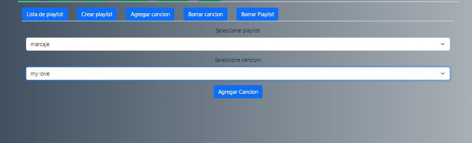

**Proyecto 1 - Manual de Usuario**

**Grupo 13**

**Seminario de sistemas 1**

**Objetivos del manual**

> ● Que el usuario se familiarice con la aplicación\
> ● Que cualquier usuario encuentre cómo utilizar la aplicación\
> ● Que se llene de información de cómo funciona la aplicación para
> cualquier usuario que nunca haya utilizado un dispositivo web

**Descripción de la aplicación.**

La aplicación es una página web donde se pueden reproducir canciones de
diferentes artistas ,se pueden escuchar y se pueden agregar o editar
nuevos, así como también Albums y artistas.

**Pasos de cómo usar la aplicación con captura**\
Cuando no más iniciamos sesión se nos redirige al portal principal:

En la página principal se puede ver la lista de canciones para
reproducir se le da en el botón Play para dar like en el botón verde

**Filtrar**

Para filtrar por álbum o por artista se utiliza el filtrador que está en
la parte superior, luego de haber seleccionado se le presiona el botón
filtrar

**Buscar**\
Para buscar una canción se selecciona en el dropdown la opción buscar
por canción, luego se presiona el botón azul de search, se desplegarán
las canciones, también tiene la opción de Buscar por artista o Buscar
por album.

**Crear Playlist**\
Se tiene la opción de crear un Playlist donde se pide el nombre,la
descripción,

**Agregar canciones al Playlist**\
También tienen la opción de agregar canciones al Playlist

**Listado de Playlist**\
Luego podemos ver en lista de Playlist el Playlist creado

**Borrar canción de Playlist**\
Cuenta con la opción de borrar canción de Playlist en la parte superior
en el botón borrar canción

**borrar Playlist**\
Cuenta con la opción borrar Playlist donde seleccionamos el Playlist que
queremos Borrar

**Lista de favoritos**\
Nos despliega la lista de canciones a las que nos han gustado, se
encuentra en el botón favoritos verde de la parte superior

**Reportes**\
En esta sección se muestra un listado de reportes empezando por el top 5
de canciones más escuchadas top3 de artistas más escuchados y top 5 de
álbumes más escuchados

**canciones escuchadas**\
También se encuentra un historial de canciones escuchadas en el tab de
la par

**Radio**\
Se encuentra la opción Radio la cual reproducirá aleatoriamente la lista
de canciones existentes en la aplicación

**Crear artista**\
Se muestra la opción de crear artista el cual mostrará el nombre, la
fecha de nacimiento,y la foto del artista

**Detalle de artista**

En esta sección se pueden ver todos los artistas creados y también se
pueden editar con el botón editar y borrar con el botón borrar

**Crear álbum**\
En esta sección se muestra la opción de crear álbum el cual mostrará el
nombre, la fecha,y la foto del álbum y artista

**Detalle de álbum**\
En esta sección se pueden ver todos los álbumes creados y también se
pueden editar con el botón editar y borrar con el botón borrar

**Crear canción**\
En esta opción si tiene la opción de crear canción añadiéndole nombre,
artista ,duración y archivo de audio

**Detalle de canción**\
En esta sección se pueden ver todas las canciones creados y también se
pueden editar con el botón editar y borrar con el botón borrar

**Agregar canción a álbum**\
Se tiene la opción de agregar canción a álbum seleccionando el álbum que
deseamos y la canción que deseamos agregar la cual no debe estar
repetida

**Borrar canción de álbum**\
Cuenta con la opción de borrar canción de álbum en la parte superior en
el botón borrar canción de álbum ,donde seleccionamos el álbum que
queremos que la canción sea removida

**Registro de usuario**\
En esta opción podemos registrar nuevos usuarios con los campos nombre,
apellido, fecha de nacimiento, contraseña y el botón registrar. el botón
se encuentra en la parte superior en el tab registro

**Login**\
En esta opción el usuario puede acceder al sistema ingresando su correo
electrónico y su contraseña Registrada

**Perfil**\
En esta opción se despliega el perfil del usuario bloqueado el cual
muestra sus datos además de la opción de editarlos

